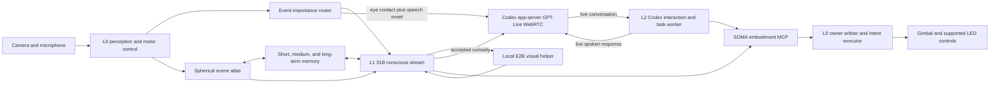

# SOMA cognitive architecture

Status: architectural source of truth; runtime implementation is tracked in
the roadmap below.

SOMA separates fast embodied perception from deliberation. The names L0, L1,
and L2 describe latency, context horizon, and authority boundaries. They do
not imply that a language model is part of the real-time control loop.

## Cognitive layers

| Layer | Primary implementation | Responsibility | Authority |
| --- | --- | --- | --- |
| L0 subconscious | Local Core ML, temporal fusion, and deterministic control | Continuous perception, target continuity, VAD, spatial coverage, immediate motor control, and interaction-readiness evidence | Sole executor of hard real-time SDK commands and physical vetoes; supplies autonomous behaviour when no cognitive lease is active |
| L1 conscious stream | Primary `gemma4:31b-cloud` plus optional local E2B visual helper | Active situational context, memory-conditioned interpretation, curiosity, social hypotheses, and goal-level attention | Broad leased control over labels, target priors, tracking, orientation, exploration policy, image acquisition, and expression; never sends SDK velocity directly |
| L2 human interaction and executive reasoning | Codex account session with app-server GPT-Live WebRTC; explicit local fallback | Conversation, high-order reasoning, tool use, coding, and user-requested work | Opens directly from authorized L0 contact evidence, or from an L1-approved proactive opening; neither route waits on the other. It receives scoped text context, may pull image context through Codex/MCP, and uses leased embodiment goals when observation or expression is needed |

The fast 31B cloud route is the primary L1 stream and may run frequently while
human or task context is active. E2B is a local visual helper within that same
stream, not an independent L0.5 consciousness or motor owner. L1 may invoke it
when remote image disclosure is disallowed or a provisional local sketch is
useful. E2B results remain provisional until the primary L1 cycle accepts or
revises them.

The running `gemma4:31b-cloud` adapter uses Ollama's local `/api/generate`
transport to reach the selected cloud route. It accepts one in-flight cycle and
one replaceable pending cycle, has an eight-second situation deadline, and
receives only the minimum context projection allowed for that cycle. Raw
biometric templates, unrestricted memory rows, and continuous camera media
remain local by default.

An ordinary L1 cycle carries no pixels. It starts from scalar scene, spatial,
memory, task, and social evidence. The runtime may offer an expiring visual
resource, but L1 must explicitly request it and receives at most one immediate
follow-up image; it cannot request another image from that follow-up. The
rolling spherical atlas remains local by default. Its current low-resolution
render can be offered for a place-level discrepancy or route-planning question,
but it is never routine conversational context.



## L1 situational stream

L1 runs event-driven situation cycles rather than continuously regenerating a
description of every frame. A cycle combines:

- the latest L0 belief and interaction-readiness evidence;
- scalar spatial-atlas coverage, revisits, and scene-entity context, with one
  explicitly requested expiring visual resource only when it is necessary;
- stable scene entities and their spatial bearings;
- retrieved person, space, task, and recent episode context;
- unresolved questions and the previous L1 situation state; and
- provenance, confidence, freshness, and privacy labels for every retrieved
  fact.

The output is a strict `SituationFrame`, not free-form control text:

```text
SituationFrame
  cycle_id, observed_at, model_route, evidence_ids
  place_hypotheses[], present_entities[], identity_hypotheses[]
  social_context, active_tasks[], changes[], contradictions[]
  uncertainty, information_gaps[], curiosity_proposals[]
  memory_write_proposals[], attention_intents[]
  interaction_recommendation, natural_language_summary
```

Human presence and a recognized identity raise the allowed L1 sampling cadence
because social context changes quickly. They create a social-deliberation
opportunity, not a speech trigger. Every such L1 cycle may conclude
`remain_silent`, `nonverbal_invitation`, or `spoken_opening`; only an explicit,
grounded L1 decision can take the latter two paths. A human's first spoken
turn requires fresh directed eye contact plus voice. The only exception is one
response inside the bounded invitation window after SOMA initiates a greeting
pulse. Once an L2 handoff opens a conversation, follow-up turns use the active
conversation lease instead of repeatedly demanding gaze. An L2 interaction
therefore needs one of two causes:

1. an explicit human contact signal satisfying that first-turn rule, or SOMA's
   own still-active greeting invitation; or
2. a grounded L1 social decision that passes relevance, confidence, temporal
   contact-history, interruption-cost, and social-appropriateness policy. A useful open question
   may supply its content, but curiosity is not mandatory: L1 may conclude that
   a plain greeting is appropriate, or that silence is preferable.

Because the selected 31B route is remote, L1 is not treated as a scarce local
compute task. While a human, active task, unresolved change, or accepted
curiosity remains present, the scheduler may keep a frequent bounded situation
stream instead of waiting for a rare alarm event. Quiet familiar scenes back
off. Measured provider latency, request budget, privacy projection, and
latest-value cancellation still bound cadence; L0 never waits for it.

Curiosity is represented as a bounded information gap with supporting memory
and evidence. It is not an unconstrained instruction to ask questions. Repeated
or rejected contact is recorded in that person's temporal history, and L1
decides whether a new purpose and the present situation justify another attempt.
A quiet or do-not-disturb state still suppresses proactive contact immediately.

### Local time and daily public-world memory

SOMA has a local-calendar day concept (`yyyy-MM-dd` in the machine's current
time zone). Public-world research is a separate, deliberately sparse input to
the situation stream: it is attempted at most once per local day, not once per
person, thought cycle, or conversation. The first attempt claims an encrypted
local daily slot, so restarting the service cannot create repeated requests on
the same day. A successful three-topic brief is retained as medium-term memory
for seven days; the slot itself expires after two days.

The collector uses an ephemeral, read-only Codex App Server Luna session with
web access. It receives no camera pixels, person identifiers, person memories,
conversation turns, local files, or MCP context. It returns only three short
public topics with HTTPS provenance. L1 performs all person-specific relevance
and interest reasoning locally: a headline never by itself authorizes an
interruption or a conversational opening. Missing interest context may create a
low-pressure information motive when the social situation already supports it;
it is never a questionnaire trigger.

### Current social thought path

A stable local person identity—an enrolled face profile or an encrypted
pseudonymous repeat-visitor cluster—is an event source for the running L1
adapter. It must first remain stable through the local identity scheduler; it
then opens at most one 31B deliberation per person every 12 seconds while the
person remains current. Gemma emits a strict JSON `L1SituationFrame`, which is
checked against the current cycle's evidence and social opportunity. Its bounded
rolling thought state carries social availability, curiosity pressure,
interruption cost, relationship uncertainty, active grounded motives, and a
short working hypothesis into the next cycle; current evidence always takes
precedence. A late frame is discarded if the person is no longer current.
`remain_silent` has no side effect. A nonverbal invitation uses a bounded L0
greeting overlay: a small down-and-return bow that releases its lease as soon
as it completes, rather than a side-to-side sweep or a timeout-held pose. The
face-lock state survives the overlay and resumes fixation immediately after the
return. Invitations, proactive openings, a finalized participant reply, and
normal or interrupted session closure are recorded as a per-person encrypted
contact timeline. The next L1 packet includes that timeline, so a restart
cannot erase an earlier acknowledgement and a model must reason from its
temporal context rather than a fixed social cooldown. The lifecycle records
observable facts only: an unanswered session is not relabelled as a rejection,
and any later social interpretation remains an explicit L1 consolidation task.
Writing one of these events invalidates the affected person's L1 memory
projection only after the encrypted record succeeds. A Live session also
publishes a process-local availability state: it suppresses new L1 social
opportunities and discards a late L1 social decision until that session ends.
A spoken opening transfers directly
from L1 to the account-backed Live session only when it is a question bound to
one current information motive; the same packet carries the motive's explicit
completion condition. The motive is private L2 orientation, not an opening
script: L2 begins with one question and advances the exchange responsively,
without narrating its plan or stacking its questions. A bare greeting, generic
offer of help, or unbound question cannot open Live voice. The L0 greeting expression is an asynchronous
social mirror, never a serial speech gate. L0 remains free to reject all
physical motion.

## Memory layer

Memory is an application-owned service. Models retrieve typed projections and
submit proposals; they do not write arbitrary model text directly into the
canonical database.

### Time horizons

| Horizon | Typical contents | Storage and lifecycle |
| --- | --- | --- |
| Short-term | Current scene graph, active tracks, exact recent L2 transcript turns, current goal, transient hypotheses, unresolved cues | Encrypted bounded recovery journal; raw transcript turns stay local until L1 consolidation and then expire by retention policy |
| Medium-term | Session episodes, recent visits, interaction episodes, task checkpoints, unresolved questions, rapport observations | Local episode store; retained by policy and periodically consolidated |
| Long-term | Consented identities, familiar-space models, stable person facts and preferences, relationship history, completed task history, durable semantic knowledge | Local durable store with provenance, confidence, revision history, export, correction, and deletion |

Time alone does not promote a memory. Consolidation requires recurrence,
utility, explicit user instruction, or a completed episode with sufficient
evidence. Contradictions create a new revision and reduce confidence instead of
silently overwriting history.

### Canonical records

- `entity_registry`: stable pseudonymous entity IDs, type, aliases, confidence,
  consent scope, and links to local recognition evidence.
- `identity_hypothesis`: probabilistic candidate identity with evidence source,
  freshness, alternatives, and an explicit `unknown` state.
- `relationship`: familiarity, interaction preference, trust evidence, social
  boundaries, and rapport history. Rapport is multidimensional and is never an
  authorization token.
- `person_fact`: a bounded fact or preference with source, confidence, first and
  last confirmation, sensitivity, and contradiction links.
- `space_registry`: familiar-place identity, coordinate frame, static visual
  landmarks, spherical atlas version, and access policy.
- `episode`: time-bounded event summary linked to people, spaces, tasks, media
  handles, and supporting evidence.
- `task_state`: objective, owner, progress, blockers, next action, artifacts,
  and last verified state.
- `open_question`: the information gap, expected value, evidence, target person,
  social cost, follow-up conditions, and resolution.
- `memory_link`: typed relationship among canonical records.
- `conversation_turn`: exact user or assistant transcript text, Codex thread and
  interaction IDs, opaque local participant references, ordered turn sequence,
  and pending/consolidated state. It is local-only short-term evidence, not a
  remotely projectable person fact.

Face presence, person presence, and human identity are separate variables. A
face or voice resemblance may create an identity hypothesis, but identity stays
`unknown` until a consented enrollment or another authorized confirmation
supports it. Recognition embeddings remain local by default and are not sent
to the 31B route. A remote prompt uses scoped aliases and summarized facts
instead.

`unknown` does not require forgetting every encounter. Repeated local ArcFace
matches may form an encrypted anonymous cluster whose only projected identity
is a per-install `anon_*` HMAC pseudonym. It deterministically maps to a
local-only person entity, allowing L1 to build continuity and relationship
context without projecting the pseudonym, name, face vector, or pixels to the
remote model. It carries no name or consent claim, expires under a rolling
retention policy, and can be forgotten. An anonymous cluster can become a
known identity only through a separate, explicit enrollment transition that
preserves the same person entity and its existing local memory.

Face recognition retains a compact multi-view reference set rather than a
single high-quality portrait. A local diversity selector rejects near-identical
frames and prefers a set with greater minimum embedding-space separation, so a
turn, partial profile, or changed height can contribute a representative local
view. The anonymous cluster cap is eight references and the explicit persistent
profile cap is twenty-four. This is appearance-space coverage, not a claim that
SOMA has a calibrated semantic head-pose measurement. Biometric templates stay
encrypted locally and never enter L1 or L2 prompts.

Identity is also a presence state, not a frame label. L0 records only the
discrete local transitions `arrived`, `replacement_candidate`, `replaced`, and
`departed`. A different recognized identity must recur within the replacement
evidence window before it replaces the active participant; a temporary
open-set miss therefore cannot create a second person or reopen an already
fulfilled person-context mission. Departure requires sustained absence of an
independently verified face, rather than a stalled identity inference. Only an
arrival or confirmed replacement is passed to L1 as a social deliberation
opportunity; an L1 opening is suppressed if that participant has departed
before the model responds.

### Write path

1. L0 emits timestamped observations; it never creates semantic person facts.
2. L2 appends exact finalized user and assistant transcript turns to the
   encrypted short-term journal, linked only to opaque local participant
   references. It records explicit name, preferred-language, and proactive
   contact instructions through the owner-only person-context MCP before it
   acknowledges them; raw transcript text never enters the trace or a remote
   L1 packet.
3. L1 is the default curator: it reads raw turns with situation context,
   resolves them against existing memory, and proposes typed episode, person,
   relationship, task, and open-question mutations.
4. A deterministic validator checks schema, provenance, consent, sensitivity,
   contradictions, and retention policy.
5. Accepted mutations enter the episode store and the contributing raw turns
   are linked to the derived memory IDs as consolidated.
6. A separate consolidation job promotes stable material to long-term memory.
7. Corrections and deletions propagate to derived summaries and retrieval
   indexes.

This path prevents a model hallucination from becoming an untraceable personal
memory.

### C2 implementation boundary

`SOMACore/CognitiveMemory.swift` implements the model-independent memory core.
It provides versioned typed payloads for raw conversation turns, entities, identity hypotheses,
relationships and rapport, person facts, spaces, episodes, tasks, situations,
open questions, and typed memory links. Short- and medium-term records require
policy-bounded expiry; long-term records require explicit, enrolled,
task-system, or consolidated provenance. Direct L1 inference cannot write
long-term memory.

The local store is a single-writer actor with an AES-256-GCM authenticated
journal, strict revision replay, file permissions `0700/0600`, correction
history, tier promotion, expiry compaction, and deletion compaction. A biometric
recognition reference requires consent, biometric sensitivity, and local-only
disclosure. Remote projection contains only the record's approved summary and
minimal metadata; it never serializes the typed biometric payload. The 256-bit
encryption key is supplied by the caller and is never stored beside the journal;
Keychain provisioning belongs to the future runtime integration. The
`ConversationTranscriptArchiver` already enforces exact-text preservation,
short-term/local-only policy, L2 provenance, ordered turns, and links from a
consolidated turn to its derived memories.

## Event importance and cognitive transition

L0 needs an event router, not another large language model. The router estimates
a calibrated distribution over `stay_l0`, `wake_l1`, and
`request_human_interaction`.
L1 itself decides whether an accepted cycle also needs E2B. The router uses
temporal evidence rather than one fixed score.

Important features are:

- explicit contact strength and social salience;
- change, novelty, and prediction error;
- task and memory relevance;
- identity or place mismatch;
- uncertainty and expected information gain;
- persistence and cross-modal corroboration;
- urgency and local safety state; and
- recent wake frequency, interruption cost, and temporal contact context.

Explicit directed human contact opens L2 immediately while also creating an L1
context packet in parallel. It does not wait for L1 admission or a 31B response.
Non-human novelty normally wakes L1, not L2 interaction. Immediate
physical protection remains an L0 responsibility and cannot wait for either
model. All transitions record the route distribution, evidence IDs, and the
policy reason so false wakes and missed wakes can be labelled later.

### Additional local perception models

| Capability | Purpose | Recommended placement |
| --- | --- | --- |
| Visual embedding and change encoder | Object re-identification, familiar-space matching, panorama-tile comparison, and semantic retrieval | Small Core ML or MLX encoder outside the camera callback; ANE preferred when the converted model supports it |
| Local face re-identification | Separate known profiles, anonymous repeat visitors, and genuinely unmatched evidence | ArcFace R50 Core ML worker with explicit enrollment, encrypted references, per-install pseudonyms, calibration, and a reject outcome |
| Speaker embedding and diarization | Associate speech turns without pretending that VAD or TDOA identifies a person | Local audio worker; separate from speech recognition and directional attention |
| Head pose, gaze, and gesture cues | Estimate directed social contact and nonverbal bids | Low-rate temporal model feeding the event router; avoid unsupported emotion labels |
| Audio-event classifier | Distinguish directed speech, alarm-like events, impact, and ambient noise | Small local model beside VAD; it does not infer meaning from speech |
| Temporal importance model | Fuse the above signals into calibrated transition probabilities | Small labelled MLP, TCN, or state-space model; no direct motor or dialogue authority |

The first learned addition should be the temporal importance model and its
labelled evaluation corpus. Large-model output is unsuitable as the sole wake
gate because its latency and calibration are not part of L0.

### C3 implementation boundary

`SOMACore/EventImportance.swift` implements a model-independent event vector,
a versioned bootstrap parameter set, numerically stable softmax distribution,
and a separate transition policy. The policy keeps immediate physical
protection in L0, masks human interaction unless directed contact or an accepted memory
curiosity is present with a human, and does not let optional-wake rate control
suppress strong explicit contact. The result records the model version, all
three route probabilities, bounded evidence IDs, the recommended route, and the
policy reason. Its dispatch contract independently states whether to open L2 interaction,
prepare L1 context, and bypass L1 admission. A supplied unit-interval draw makes
categorical sampling exactly replayable.

`SOMACore/CognitiveInteraction.swift` defines the next transport boundary. A
`HumanInteractionWakeRequest` carries scalar contact evidence and the
deployment-measured in-memory pre-roll duration. A `CodexInteractionTurn`
carries the accepted final transcript, interaction/turn IDs, timing, bounded
evidence IDs, and a scoped context reference. It has no raw-audio field. These
types make direct L0-to-L2 wake and transcript delivery independently testable
without putting audio in the cognitive contract. `SpeechTurnSegmenter` now
closes the runtime boundary: voice without an authorized C3 wake cannot open a
turn, VAD analysis lookback is accounted for, utterances are duration-bounded,
and a refractory interval prevents one offset from immediately reopening the
same turn.

`ConversationContactGate` supplies the missing social-entry state. System
Vision landmarks provide a transient, non-identifying estimate from bilateral
eyes and pupils, frontal yaw, and social-fovea alignment. The estimate is fresh
for 450 ms. A greeting expression grants one response attempt for eight seconds.
Only a confirmed app-server realtime session or a successful fallback handoff opens
the conversation; 60 seconds without confirmed user activity closes the Live
session. This separates ambient speech near a detected face from
speech addressed to SOMA without turning face detection into identity.

`soma-event-eval` fits temperature on one partition and reports held-out
accuracy, negative log likelihood, Brier score, expected calibration error,
false wakes, missed wakes, unauthorized interaction requests, and per-route
precision/recall. Its `bootstrap-v3` data contains 32 authored contract cases;
it is not sensor-derived and therefore cannot support a deployment-accuracy
claim. The live router remains disconnected from L0 until a time-aligned real
event corpus is labelled and shadow-mode latency and wake behaviour pass.

## Embodiment MCP

L1 and L2 share one local `soma-embodiment` MCP server. They have broad
semantic control authority, while the existing L0 owner arbiter remains the
sole path to physical SDK commands. This is not an advisory-only boundary:
cognitive layers can change what is labelled, attended, tracked, viewed, and
explored, as well as the direction and movement character. L0 translates those
goals into continuously corrected motion and retains only physical-limit,
watchdog, stale-evidence, and immediate-safety vetoes.

Mutating requests carry the source layer, owner, reason, evidence IDs, lease,
priority, cancellation token, and expected completion condition. Lease expiry,
cancellation, irrecoverable target ambiguity, or a higher-authority owner
returns control to L0's default policy. A layer name alone is not a blanket
permission tier: L1 and L2 can issue the same goal types, while the
arbiter resolves explicit user commands, task priority, recency, and active
safety state.

### Read tools

| Tool | Result |
| --- | --- |
| `get_attention_state` | Current target, controller state, owner, uncertainty, and active lease |
| `list_scene_entities` | Stable scene IDs, labels, posterior, bearing, visibility, freshness, and action eligibility |
| `get_spatial_map` | Coverage, familiar-space hypothesis, atlas version, and available bearings |
| `capture_view` | A fresh image resource for a scene ID or bounded azimuth/elevation request, with capture time and short TTL |
| `capture_panorama` | A versioned low-resolution spatial atlas or selected changed tiles; full refresh is explicit |
| `get_embodiment_capabilities` | Supported gimbal, tracking, image, expression, and LED operations with measured limits |

### Action tools

| Tool | Meaning |
| --- | --- |
| `register_semantic_target` | Bind a caller-provided label and visual descriptor to an existing scene ID or current view; returns a target reference and confidence |
| `update_semantic_target` | Revise a target's label, aliases, descriptor, or spatial binding without changing its stable target reference |
| `remove_semantic_target` | Remove the caller's target registration and any policy references owned by the same lease |
| `set_attention_policy` | Set per-target log priors and tracking commitment plus selection temperature, novelty, habituation, and dwell parameters; L0 combines them with live likelihoods into probabilities |
| `track_target` | Ask L0 to maintain the target reference for a bounded lease; L0 owns re-identification and servo timing |
| `orient_to` | Request a gimbal-home-relative spherical bearing with a movement style and completion tolerance |
| `set_exploration_policy` | Select probabilistic coverage, novelty, memory-gap, target-biased, or directed survey behaviour with spherical regions, directional distributions, dwell, continuity, and tempo |
| `scan_region` | Execute the active exploration policy over a bounded spherical region rather than a hardcoded motor sweep |
| `express_gimbal` | Execute a named social motion primitive such as acknowledge, nod, attentive reframe, or brief thinking glance |
| `set_led_signal` | Request a semantic LED state only when the capability report exposes a validated mapping |
| `release_embodiment` | Cancel the caller's lease and return authority to L0 |

`register_semantic_target` does not make a string label into a motor target. It
creates a descriptor tied to current visual and spatial evidence. A local
re-identification worker updates that target between slow L1 cycles, and L0
rejects motion when the target reference is stale, ambiguous, or outside the
active lease.

`SOMACore/CognitiveEmbodiment.swift` is the transport-independent version-1
contract. It already represents requests from both cognitive layers above L0,
semantic target registration, probabilistic attention priors, tracking,
orientation, spherical exploration regions and direction distributions, view
capture, and social expression. These parameters are lease-scoped overlays,
not global constants: they revert together when the request ends. The MCP
stdio transport, current-user Unix socket, and L0 executor are now implemented.
The semantic arbiter validates target ownership, requires target registration
before tracking, applies one active motor lease, rejects equal/lower-priority
foreign owners, permits higher-priority preemption, expires owned state, and
releases it as a unit. It still has no SDK dependency. A separately enabled L0
adapter consumes only accepted decisions and uses the existing gimbal owner
queue, pose feedback, spherical route planner, joint envelope, and watchdog.
Snapshots report `physical_actuation_enabled` explicitly; default runs remain
shadow-only, while the authorized persistent launcher reports `mode=active`.

The current executable is `soma-embodiment`. It implements the MCP lifecycle
and tool calls over newline-delimited stdio, then forwards one bounded request
per connection to the L0 socket. The deployed surface contains
`get_embodiment_state`, `list_scene_entities`, `get_spatial_map`,
`get_view_capture`,
`register_semantic_target`, `remove_semantic_target`,
`set_attention_policy`, `track_target`, `orient_to`,
`set_exploration_policy`, `capture_view`, `express_gimbal`, and
`release_embodiment`. Orientation, grounded tracking, policy-shaped exploration,
active view capture, and bounded social expression have physical L0 adapters.
`capture_view` waits for hysteretic pose settling, captures the next
exposure-aligned frame, and returns a 60-second, mode-`0600` JPEG resource;
`get_view_capture` provides request-ID recovery. LED operations in the broader
table remain target interfaces, not current implementation claims.
The wire contract follows the MCP 2025-11-25
[lifecycle](https://modelcontextprotocol.io/specification/2025-11-25/basic/lifecycle),
[stdio transport](https://modelcontextprotocol.io/specification/2025-11-25/basic/transports),
and [tool](https://modelcontextprotocol.io/specification/2025-11-25/server/tools)
specifications; stdout contains JSON-RPC messages only.

### Person-context tools

L2 needs more than a camera lease: it must be able to retrieve and maintain
the explicitly shared social context of the person it is speaking with. Each
Live session receives a short-lived opaque capability bound to that one local
person reference. It may read and update that person's context, and it may use
the ordinary bounded perception and embodiment tools for conversation. It
cannot query another person's context. Administrator status is reserved for
explicit external work; it is not required to look, track, explore, capture a
view, or make a brief social expression during ordinary conversation. The same
current-user MCP endpoint therefore provides `get_person_context`,
`set_preferred_language`, `clear_preferred_language`,
`set_contact_preference`, `set_person_rapport`, `set_person_fact`, and
`remove_person_fact`. A person-context request reaches the L0-owned encrypted
journal through the current-user socket; an MCP child never opens a competing
journal writer. Every MCP mutation requires an explicit user confirmation flag,
becomes a revisioned explicit-user record, and is projected to L1/L2 only when
its disclosure policy permits it. The returned reference is an opaque local
person UUID for tool routing, never a name or biometric template. Face vectors,
raw media, raw transcripts, and local-only identity records are unavailable to
these tools.

Social-information collection is memory-derived rather than a fixed session
questionnaire. `PersonContextSnapshot` computes the current mission from stored
facts: a respectful name is required only while absent; language, contact
preference, and relationship context remain optional signals for a relevant
future conversation. An unsatisfied mission is included in L1/L2 context and
can be checked again through `get_person_context`. Once its required fields are
stored, the mission is omitted entirely from the session context, so a new
session does not repeat a completed request.

When a person has an explicit language preference, L1 receives only the
normalized BCP-47 tag and creates a compact native-language Live-session
directive. L0 caches and relays that directive without translating it or
sending biometric material; L2 treats it as the default response language
until the person explicitly changes language.

Image tools return transient resource handles. Persistence is a separate,
explicit operation with retention and consent policy; raw images never enter
the scalar operational trace.

Social gimbal expressions are parameterized trajectories, not special-case
velocity commands. They share current pose, joint limits, tracking authority,
and preemption rules with normal motion. A gesture cannot steal control from an
active safety stop or silently break a social target lock.

## LED social signalling

The Tiny 2 Lite has a three-channel RGB PWM indicator and a firmware pattern
engine. It is not an arbitrary 24-bit RGB endpoint. The host selects a firmware
`state_id`, and the firmware maps that state to a predefined RGB colour and
steady/blink action. Firmware inspection shows colour codes `0...7`, brightness
levels `0...3`, and named states including normal work, tracking, network error,
pairing, and upgrade states. Steady/blink actions exist; marquee and queue
actions report unsupported on this hardware.

The supplied and installed `libdev` evidence exposes:

- `sysMgSetIndicatorStateR(uint8_t state_id)`;
- `sysMgClearIndicatorStateR(uint8_t state_id)`;
- `sysMgSetLedBrightnessR(uint8_t)` and `sysMgGetLedBrightnessR(uint8_t&)`;
- `sysMgSetLedEnabledR(bool)` and `sysMgGetLedEnabledR(bool&)`; and
- `cameraSetLedCtrlU(bool)`, a separate Tiny 2-series special pattern used while
  configuring zone or hand tracking.

On the connected Tiny 2 Lite with firmware `6.2.8.1`, read-only calls returned
success for LED enabled state and brightness, with brightness level `3`.
The Tally Light API returned unsupported and is not the RGB status indicator.
The resulting capability contract is `rgb_palette=true`,
`arbitrary_rgb=false`, four brightness levels, firmware patterns enabled, and
Tally unavailable.

The MCP contract uses human-facing interaction meanings rather than assuming
colours or exposing raw implementation status:

- `available`
- `attention_requested`
- `listening`
- `thinking`
- `speaking`
- `do_not_disturb`
- `fault`

The native boundary now exposes `setIndicatorState(state_id)`,
`clearIndicatorState(state_id)`, `setLedBrightness(0...3)`, and
`setLedEnabled(bool)`. It does not expose RGB triplets. Social state names map to
the allowlisted non-error firmware IDs `16` target-lost, `17` target-lock,
`18` gesture-recognizing, `54` normal-work, and `57` tracking-work. The L0
priority is `speaking > working > listening > contact_ready > human_detected > exploring`.
Firmware colour and SOMA cadence jointly encode what a nearby person can do:
the exploration beacon means SOMA is not engaged, steady presence means it has
noticed someone, the double invitation means "make eye contact and speak", calm
long-on listening means "keep speaking", the slow work heartbeat means "please
wait", and steady speaking means "listen to the response". The cadence
scheduler is generation-bound, so a stale timer cannot revive a previous state.
On every transition the bridge sets the new state and clears the previous
SOMA-owned state. Its native session remembers the prior enabled/brightness
values, clears all SOMA-owned IDs, and restores any changed global setting on
normal shutdown, signal, input closure, or exceptional return. Existing
firmware status priority remains authoritative; SOMA never clears an unrelated
system state. The connected camera reports its baseline LED setting as disabled,
so the persistent L0 session enables it after native bridge readiness and the
helper restores disabled on exit. Exact hue is firmware-defined until the allowlist is visually
characterized on the connected camera.

LED signals are secondary and redundant with speech and gimbal behaviour. They
must respect quiet/privacy preferences and must not override firmware status or
claim that the microphone is muted when only a cosmetic light changed.

## Panoramic spatial memory

A panorama is useful when treated as a time-aware spatial atlas, not as one
instantaneous photograph. L0 now maintains both a bounded scalar atlas and an
optional rolling equirectangular image band. The scalar atlas remains shared by
coverage exploration, scene bearings, MCP reads, and route planning. The image
worker is independent of the real-time perception queue: it buffers only the
newest admitted frame, waits for a following measured attitude, interpolates
the exposure pose, and rejects an unbracketed frame. A single
`GimbalKinematicEnvelope` defines live tracking and autonomous camera-centre
limits, so the image and scalar maps describe the same reachable space.
The raster itself uses a calibration-independent world orientation. The SDK
attitude axes are converted once to canonical visual yaw/elevation before a
full 3D camera basis couples yaw and pitch during source projection;
independently warping the two axes is not considered a valid spherical panorama.

The current compositor uses quality-selective spherical pixels rather than an
ever-growing temporal average. Angular velocity from the two measured attitude
samples and distance from the optical centre determine observation quality.
Frames below the stable projection threshold are rejected, and an empty or
filled pixel is written only by stable evidence that clears replacement
hysteresis. Pairwise Vision translation registration refines small residual
pose errors only when stable consecutive views overlap; the correction is
confidence-gated, robustly bounded, and each pair remains anchored to measured
gimbal attitude rather than accumulating visual odometry. OpenCV channel
exposure compensation and feather seam weights operate after spherical warping
on the same utility queue. The same
per-direction quality is projected into the scalar atlas: no-target exploration
combines recency, panorama deficit, and place uncertainty as expected
information gain and plans a centred, reachable observation pose. This is an
active-perception loop—perception uncertainty shapes where the sensor looks
next—without giving image pixels social or object motor authority.

The implemented fixed-base spherical cells store:

- bearing, scalar coverage/recency, panorama quality, and route evidence;
- one versioned normalized Vision Feature Print embedding with observation count;
- familiarity, appearance conflict, and expected information gain; and
- separately maintained visible/offscreen scene entities and provenance.

Static background and dynamic entities are separate layers. The current
compositor always masks people; non-human detections remain scene content. A
masked person frame may contribute the
remaining background, but a detector gap is held out for 750 ms. The rolling
JPEG is overwritten in place and its schema-7 metadata exposes reachable/raw
and high-quality coverage, photometric blending, low-quality rejection,
registration, and place-revisit counters. The
current learned feature print runs at most once per second on the utility
panorama queue and closes revisits only when encoder identity, revision, vector
dimension, and fixed attitude cell agree. Compatible embeddings may persist
across sessions in one bounded owner-only file; panorama pixels and dynamic
entities do not. Depth/parallax modelling, metric mobile SLAM, cross-device
place identity, and a labelled viewpoint/lighting robustness evaluation remain
later layers.

L1 normally receives a compact composite: a low-resolution atlas, the current
high-resolution view, highlighted changed tiles, and structured scene metadata.
This improves spatial context and change reasoning while avoiding the cost and
ambiguity of sending a full-resolution panorama on every cycle.

The main failure modes are parallax from nearby objects, exposure changes,
moving people, stale tiles, gimbal-pose error, and seams between captures.
The live 86-mode path now uses held-out-validated normalized intrinsics, Brown
radial distortion, and camera-to-gimbal rotation in object bearing, coverage,
and panorama projection; its five-pair/369-match holdout improves reprojection
RMSE from 41.325 px to 6.098 px with 8.204 px p90. Pose freshness and bounded
local registration are also enforced.
Rotation-centre parallax and a labelled changed/unchanged scene evaluation
remain open acceptance items. A
time-misaligned panorama must never be described to L1 as a single current
frame.

## L2 voice and Codex account integration

Human interaction is an L2 capability, not a separate cognitive layer. The
first explicit-contact event requires directed eye contact and voice, except for
the bounded response to a greeting pulse initiated by SOMA. An authorized event
opens an L2 turn directly from L0 and never
waits for the 31B L1 stream. L1 prepares richer situation and memory context in
parallel. An accepted L1 social decision may also open a turn; recognized
identity alone never does. L1 receives a recognized participant only at a
local presence arrival or confirmed replacement, never from repeated frame
samples or an unconfirmed identity mismatch.
Automatic speech remains disabled until SOMA authorizes the turn. The local
fallback retains a bounded in-memory pre-roll; the Live route reuses the same
L0 PCM stream and schedules a one-second memory-only pre-roll. L0/L1
context is represented by a bounded `ContextPacket` for prompt, conversation,
or MCP-tool projection:

```text
ContextPacket
  interaction_id, trigger, people_present[], identity_confidence
  place, current_situation, recent_episode_summary
  active_tasks[], open_questions[], rapport_projection
  current_attention, available_tools[], privacy_scope
  source_evidence_ids[], freshness, contradictions[]
```

The primary route is `--l2-live-voice`, using the installed app-server's
`maple` voice. L0 authorizes an opening only when a
Core ML voice onset coincides with fresh directed eye contact, or when a human
answers one recent SOMA social pulse. A dedicated helper starts the installed
Codex app-server with `realtime_conversation`, creates an ephemeral
`realtime_voice` thread that is not materialized in the Codex desktop task
list, and negotiates V3 WebRTC under the existing ChatGPT account. L0 batches its
already captured OBSBOT PCM into 60 ms packets and feeds a persistent Web Audio
worklet on that peer connection, including a bounded one-second memory-only
pre-roll. There is no Accessibility shortcut and no second microphone capture.
The remote WebRTC audio track is played directly. GPT-Live owns multilingual recognition,
interruption handling, spoken output, and Codex response handoff. SOMA does not
persist raw audio. Each finalized Live transcript turn is written into the
encrypted short-term local journal; no raw transcript enters the scalar trace
or remote L1 packet. L1 consolidation of those local turns into durable typed
memories remains a separate pending pass.
The installed realtime start path currently selects the `maple` voice and does
not send a model override; the Codex app-server therefore owns the realtime
model choice. `maple` is a voice, not a reasoning-model identifier.

`soma-codex-bridge` plus Apple Speech recognition and local speech synthesis is
retained only as a separately enabled diagnostic/fallback path. Its 5.45-second
account smoke and 1.73-second local synthesis smoke do not measure GPT-Live and
are not conversational-latency acceptance evidence.

Text and image context use distinct contracts. V3 `initialItems` injects the
opening role-bearing text context. Changed, ephemeral E2B camera summaries are
forwarded through `thread/realtime/appendText`, so the conversation receives
current visual meaning without retaining or transmitting raw camera frames.
The realtime append API does not accept images. `capture_view`
therefore returns its bounded settled JPEG as an MCP image block and 60-second
resource link to a Codex tool turn; the grounded result can be appended back to
Live as text. Direct image injection into the realtime session remains
unclaimed.
Closing an interaction releases embodiment leases, persists its observed social
outcome, and finalizes the interaction state. Its raw local turns are ready for
the same `gemma4:31b-cloud` consolidation stream when that pass is enabled.
Structured output will remain a proposal: L1 reconciles it with current memory
and the deterministic validator owns the commit.

Official implementation references:

- [Codex authentication](https://learn.chatgpt.com/docs/auth)
- [Codex non-interactive mode](https://learn.chatgpt.com/docs/non-interactive-mode)
- [ChatGPT Voice](https://learn.chatgpt.com/docs/features/voice)
- [Codex CLI developer commands](https://learn.chatgpt.com/docs/developer-commands?surface=cli)
- [Voice agents](https://developers.openai.com/api/docs/guides/voice-agents)
- [Apple SpeechAnalyzer](https://developer.apple.com/documentation/speech/speechanalyzer)
- [Apple SpeechAnalyzer and SpeechTranscriber session](https://developer.apple.com/videos/play/wwdc2025/277/)

## Development roadmap

| Milestone | Status | Acceptance evidence |
| --- | --- | --- |
| C0 L0 embodied baseline | Implemented; physical behaviour tuning continues | Bounded local perception/control traces, owner arbitration, and existing core checks |
| C1 E2B L1 visual helper | Worker implemented; opt-in for visual audit | Direct-MLX bounded worker is advisory, consumes substantial unified memory, and has no independent layer or motor lease |
| C2 Memory contracts and store | Core, encrypted runtime store, L1 read projection, and finalized Live-turn ingestion implemented; consolidation remains pending | Versioned schemas, exact encrypted local L2 turns, L1 consolidation links, provenance/consent validator, encrypted short/medium/long store, correction, deletion, policy-filtered remote projection, and replay checks |
| C3 Event-importance router | Core implemented; deployment labels and shadow integration pending | Versioned route probabilities, direct L2 interaction dispatch plus parallel L1 context, interaction/safety policy masks, 32-row bootstrap contract, calibration and false/missed-wake report; real labelled corpus still required |
| C4 31B L1 conscious stream | Event-driven local-person situation runtime and policy-filtered memory retrieval implemented; consolidation remains pending | One Gemma 31B stream, structured `SituationFrame`, bounded current-presence check, explicit silence/nonverbal/speech decisions, allowed memory summaries, rapport, and information motives naturalized at decision time, then asynchronous memory consolidation |
| C5 Local embodiment MCP | Shadow transport implemented and deployed | MCP lifecycle plus thirteen schema-described tools; stdio to owner-only Unix socket; live L0 scene/atlas/state reply and scalar audit trace; no actuator writes |
| C6 Leased embodiment actions | Implemented and physically validated | Target ownership, registration-before-tracking, priority preemption, independently scheduled expiry, owner release, explicit-scene permanence, probabilistic descriptor ambiguity, orient/grounded-track/policy-explore/active-view/social-expression execution, transient image return, labelled target reacquisition, and native stop/watchdog pass |
| C7 Panoramic spatial memory | Learned fixed-base place memory and active mapping implemented; robustness evaluation pending | Capture-aligned spherical projection, bounded image registration, best-observation pixels, versioned Feature Print revisits, bounded cross-session persistence, information-gain reachable view planning, MCP map projection, static/dynamic separation and familiar-space evaluation |
| C8 L0-to-L2 interaction bridge | Account-authenticated app-server GPT-Live WebRTC handshake implemented; physical conversation validation pending | Directed eye-contact plus VAD opening, bot-pulse exception, V3 WebRTC session, one-second PCM pre-roll, text context injection, duplicate-launch suppression, scalar audit, and an explicit local CLI/ASR/TTS fallback |
| C9 LED signalling | Firmware ABI, native L0 state wiring, and semantic cadence engine implemented; MCP tool and visual hue characterization pending | `rgb_palette=true`, `arbitrary_rgb=false`, allowlisted state set/clear, six distinct steady/blink signatures, brightness/enabled access, shutdown restore, semantic priority trace, and physical SDK acknowledgements |
| C10 End-to-end social evaluation | Planned | Labelled explicit-contact, curiosity, dialogue, task, opt-out, memory-correction, and embodiment scenarios |

The physical intent adapter and its end-to-end target/view gates are complete.
The next integration gate is C4 consolidation: the primary 31B L1 stream must
turn raw L2 transcript turns into validated memory proposals and use the C6 MCP
surface for active observation. Place
re-identification remains deliberately ambiguity-aware and needs a
labelled viewpoint, lighting, and change-evaluation corpus before its
familiarity can influence anything beyond no-target exploration. C3 still needs
deployment labels before it schedules L1 or opens L2 interaction automatically. C8 barge-in, the C9 semantic MCP surface, and C10 remain subsequent
work. Every cognitive layer
receives the same semantic surface, while SDK calls stay behind the L0 arbiter
and each stage remains independently disableable.
