# SOMA cognitive architecture

Status: architectural source of truth; runtime implementation is tracked in
the roadmap below.

SOMA separates fast embodied perception from deliberation. The names L0, L1,
and L2 describe latency, context horizon, and authority boundaries. They do
not imply that a language model is part of the real-time control loop.

## Cognitive layers

| Layer | Primary implementation | Responsibility | Authority |
| --- | --- | --- | --- |
| L0 subconscious | Local Core ML, temporal fusion, and deterministic control | Continuous perception, target continuity, VAD, spatial coverage, immediate motor control, and interaction-readiness evidence | Sole executor of hard real-time SDK commands and physical vetoes; supplies autonomous behaviour when no cognitive lease is active |
| L1 conscious stream | Primary `gemma4:31b-cloud` plus optional local E2B visual helper | Active situational context, memory-conditioned interpretation, curiosity, social hypotheses, and goal-level attention | Broad leased control over labels, target priors, tracking, orientation, exploration policy, image acquisition, and expression; never sends SDK velocity directly |
| L2 human interaction and executive reasoning | Codex account session plus local speech transport | Conversation, high-order reasoning, tool use, coding, and user-requested work | May be opened directly by authorized L0 contact evidence without waiting for L1; receives final transcripts and scoped context and uses leased embodiment goals when observation or expression is needed |

The fast 31B cloud route is the primary L1 stream and may run frequently while
human or task context is active. E2B is a local visual helper within that same
stream, not an independent L0.5 consciousness or motor owner. L1 may invoke it
when remote image disclosure is disallowed or a provisional local sketch is
useful. E2B results remain provisional until the primary L1 cycle accepts or
revises them.

The initial `gemma4:31b-cloud` adapter crosses a network boundary. It receives
only the minimum context projection allowed for that cycle. Raw biometric
templates, unrestricted memory rows, and continuous camera media remain local
by default.

```mermaid
flowchart LR
    Sensors["Camera and microphone"] --> L0["L0 perception and motor control"]
    L0 --> Router["Event-importance router"]
    Router --> L1["L1 31B conscious stream"]
    Router -->|"explicit human contact"| Speech["Local speech turn transport"]
    L1 --> Helper["Local E2B visual helper"]
    Helper --> L1
    Memory["Short, medium, and long-term memory"] <--> L1
    L1 -->|"accepted curiosity"| Speech
    Speech -->|"final transcript and scoped context"| Codex["L2 Codex interaction and task worker"]
    Codex -->|"response and task result"| Speech
    L1 --> MCP["SOMA embodiment MCP"]
    Codex --> MCP
    MCP --> Arbiter["L0 owner arbiter and intent executor"]
    Arbiter --> Gimbal["Gimbal and supported LED controls"]
    L0 --> Atlas["Spherical scene atlas"]
    Atlas <--> Memory
    Atlas --> L1
```



## L1 situational stream

L1 runs event-driven situation cycles rather than continuously regenerating a
description of every frame. A cycle combines:

- the latest L0 belief and interaction-readiness evidence;
- a current high-resolution view and, when useful, a low-resolution spatial
  atlas with change overlays;
- stable scene entities and their spatial bearings;
- retrieved person, space, task, and recent episode context;
- unresolved questions and the previous L1 situation state; and
- provenance, confidence, freshness, and privacy labels for every retrieved
  fact.

The output is a strict `SituationFrame`, not free-form control text:

```text
SituationFrame
  cycle_id, observed_at, model_route, evidence_ids
  place_hypotheses[], present_entities[], identity_hypotheses[]
  social_context, active_tasks[], changes[], contradictions[]
  uncertainty, information_gaps[], curiosity_proposals[]
  memory_write_proposals[], attention_intents[]
  interaction_recommendation, natural_language_summary
```

Human presence raises the allowed L1 sampling cadence because social context
changes quickly. Presence alone does not start speech. An L2 interaction needs
one of two causes:

1. an explicit human contact signal, such as directed speech, an accepted wake
   gesture, or a deliberate interaction request; or
2. a memory-grounded curiosity proposal that passes relevance, confidence,
   cooldown, interruption-cost, and social-appropriateness policy.

Because the selected 31B route is remote, L1 is not treated as a scarce local
compute task. While a human, active task, unresolved change, or accepted
curiosity remains present, the scheduler may keep a frequent bounded situation
stream instead of waiting for a rare alarm event. Quiet familiar scenes back
off. Measured provider latency, request budget, privacy projection, and
latest-value cancellation still bound cadence; L0 never waits for it.

Curiosity is represented as a bounded information gap with supporting memory
and evidence. It is not an unconstrained instruction to ask questions. Repeated
or rejected questions receive a cooldown, and a quiet or do-not-disturb state
suppresses proactive contact.

## Memory layer

Memory is an application-owned service. Models retrieve typed projections and
submit proposals; they do not write arbitrary model text directly into the
canonical database.

### Time horizons

| Horizon | Typical contents | Storage and lifecycle |
| --- | --- | --- |
| Short-term | Current scene graph, active tracks, recent utterance turns, current goal, transient hypotheses, unresolved cues | In-memory working set plus a bounded recovery journal; expires or is summarized when the situation closes |
| Medium-term | Session episodes, recent visits, interaction episodes, task checkpoints, unresolved questions, rapport observations | Local episode store; retained by policy and periodically consolidated |
| Long-term | Consented identities, familiar-space models, stable person facts and preferences, relationship history, completed task history, durable semantic knowledge | Local durable store with provenance, confidence, revision history, export, correction, and deletion |

Time alone does not promote a memory. Consolidation requires recurrence,
utility, explicit user instruction, or a completed episode with sufficient
evidence. Contradictions create a new revision and reduce confidence instead of
silently overwriting history.

### Canonical records

- `entity_registry`: stable pseudonymous entity IDs, type, aliases, confidence,
  consent scope, and links to local recognition evidence.
- `identity_hypothesis`: probabilistic candidate identity with evidence source,
  freshness, alternatives, and an explicit `unknown` state.
- `relationship`: familiarity, interaction preference, trust evidence, social
  boundaries, and rapport history. Rapport is multidimensional and is never an
  authorization token.
- `person_fact`: a bounded fact or preference with source, confidence, first and
  last confirmation, sensitivity, and contradiction links.
- `space_registry`: familiar-place identity, coordinate frame, static visual
  landmarks, spherical atlas version, and access policy.
- `episode`: time-bounded event summary linked to people, spaces, tasks, media
  handles, and supporting evidence.
- `task_state`: objective, owner, progress, blockers, next action, artifacts,
  and last verified state.
- `open_question`: the information gap, expected value, evidence, target person,
  social cost, cooldown, and resolution.
- `memory_link`: typed relationship among canonical records.

Face presence, person presence, and human identity are separate variables. A
face or voice resemblance may create an identity hypothesis, but identity stays
`unknown` until a consented enrollment or another authorized confirmation
supports it. Recognition embeddings remain local by default and are not sent
to the 31B route. A remote prompt uses scoped aliases and summarized facts
instead.

### Write path

1. L0 emits timestamped observations; it never creates semantic person facts.
2. L1 proposes a typed memory mutation with evidence IDs and confidence.
3. A deterministic validator checks schema, provenance, consent, sensitivity,
   contradictions, and retention policy.
4. Accepted mutations enter the episode store.
5. A separate consolidation job promotes stable material to long-term memory.
6. Corrections and deletions propagate to derived summaries and retrieval
   indexes.

This path prevents a model hallucination from becoming an untraceable personal
memory.

### C2 implementation boundary

`SOMACore/CognitiveMemory.swift` implements the model-independent memory core.
It provides versioned typed payloads for entities, identity hypotheses,
relationships and rapport, person facts, spaces, episodes, tasks, situations,
open questions, and typed memory links. Short- and medium-term records require
policy-bounded expiry; long-term records require explicit, enrolled,
task-system, or consolidated provenance. Direct L1 inference cannot write
long-term memory.

The local store is a single-writer actor with an AES-256-GCM authenticated
journal, strict revision replay, file permissions `0700/0600`, correction
history, tier promotion, expiry compaction, and deletion compaction. A biometric
recognition reference requires consent, biometric sensitivity, and local-only
disclosure. Remote projection contains only the record's approved summary and
minimal metadata; it never serializes the typed biometric payload. The 256-bit
encryption key is supplied by the caller and is never stored beside the journal;
Keychain provisioning belongs to the future runtime integration.

## Event importance and cognitive transition

L0 needs an event router, not another large language model. The router estimates
a calibrated distribution over `stay_l0`, `wake_l1`, and
`request_human_interaction`.
L1 itself decides whether an accepted cycle also needs E2B. The router uses
temporal evidence rather than one fixed score.

Important features are:

- explicit contact strength and social salience;
- change, novelty, and prediction error;
- task and memory relevance;
- identity or place mismatch;
- uncertainty and expected information gain;
- persistence and cross-modal corroboration;
- urgency and local safety state; and
- recent wake frequency, interruption cost, and cooldown.

Explicit directed human contact opens L2 immediately while also creating an L1
context packet in parallel. It does not wait for L1 admission or a 31B response.
Non-human novelty normally wakes L1, not L2 interaction. Immediate
physical protection remains an L0 responsibility and cannot wait for either
model. All transitions record the route distribution, evidence IDs, and the
policy reason so false wakes and missed wakes can be labelled later.

### Additional local perception models

| Capability | Purpose | Recommended placement |
| --- | --- | --- |
| Visual embedding and change encoder | Object re-identification, familiar-space matching, panorama-tile comparison, and semantic retrieval | Small Core ML or MLX encoder outside the camera callback; ANE preferred when the converted model supports it |
| Consented face verification | Distinguish a known person hypothesis from generic face presence | Local-only identity service with enrollment, confidence calibration, and an `unknown` outcome |
| Speaker embedding and diarization | Associate speech turns without pretending that VAD or TDOA identifies a person | Local audio worker; separate from speech recognition and directional attention |
| Head pose, gaze, and gesture cues | Estimate directed social contact and nonverbal bids | Low-rate temporal model feeding the event router; avoid unsupported emotion labels |
| Audio-event classifier | Distinguish directed speech, alarm-like events, impact, and ambient noise | Small local model beside VAD; it does not infer meaning from speech |
| Temporal importance model | Fuse the above signals into calibrated transition probabilities | Small labelled MLP, TCN, or state-space model; no direct motor or dialogue authority |

The first learned addition should be the temporal importance model and its
labelled evaluation corpus. Large-model output is unsuitable as the sole wake
gate because its latency and calibration are not part of L0.

### C3 implementation boundary

`SOMACore/EventImportance.swift` implements a model-independent event vector,
a versioned bootstrap parameter set, numerically stable softmax distribution,
and a separate transition policy. The policy keeps immediate physical
protection in L0, masks human interaction unless directed contact or an accepted memory
curiosity is present with a human, and does not let optional-wake cooldown
suppress strong explicit contact. The result records the model version, all
three route probabilities, bounded evidence IDs, the recommended route, and the
policy reason. Its dispatch contract independently states whether to open L2 interaction,
prepare L1 context, and bypass L1 admission. A supplied unit-interval draw makes
categorical sampling exactly replayable.

`SOMACore/CognitiveInteraction.swift` defines the next transport boundary. A
`HumanInteractionWakeRequest` carries scalar contact evidence and the
deployment-measured in-memory pre-roll duration. A `CodexInteractionTurn`
carries the accepted final transcript, interaction/turn IDs, timing, bounded
evidence IDs, and a scoped context reference. It has no raw-audio field. These
types make direct L0-to-L2 wake and transcript delivery independently testable
before live speech recognition is connected.

`soma-event-eval` fits temperature on one partition and reports held-out
accuracy, negative log likelihood, Brier score, expected calibration error,
false wakes, missed wakes, unauthorized interaction requests, and per-route
precision/recall. Its `bootstrap-v3` data contains 32 authored contract cases;
it is not sensor-derived and therefore cannot support a deployment-accuracy
claim. The live router remains disconnected from L0 until a time-aligned real
event corpus is labelled and shadow-mode latency and wake behaviour pass.

## Embodiment MCP

L1 and L2 share one local `soma-embodiment` MCP server. They have broad
semantic control authority, while the existing L0 owner arbiter remains the
sole path to physical SDK commands. This is not an advisory-only boundary:
cognitive layers can change what is labelled, attended, tracked, viewed, and
explored, as well as the direction and movement character. L0 translates those
goals into continuously corrected motion and retains only physical-limit,
watchdog, stale-evidence, and immediate-safety vetoes.

Mutating requests carry the source layer, owner, reason, evidence IDs, lease,
priority, cancellation token, and expected completion condition. Lease expiry,
cancellation, irrecoverable target ambiguity, or a higher-authority owner
returns control to L0's default policy. A layer name alone is not a blanket
permission tier: L1 and L2 can issue the same goal types, while the
arbiter resolves explicit user commands, task priority, recency, and active
safety state.

### Read tools

| Tool | Result |
| --- | --- |
| `get_attention_state` | Current target, controller state, owner, uncertainty, and active lease |
| `list_scene_entities` | Stable scene IDs, labels, posterior, bearing, visibility, freshness, and action eligibility |
| `get_spatial_map` | Coverage, familiar-space hypothesis, atlas version, and available bearings |
| `capture_view` | A fresh image resource for a scene ID or bounded azimuth/elevation request, with capture time and short TTL |
| `capture_panorama` | A versioned low-resolution spatial atlas or selected changed tiles; full refresh is explicit |
| `get_embodiment_capabilities` | Supported gimbal, tracking, image, expression, and LED operations with measured limits |

### Action tools

| Tool | Meaning |
| --- | --- |
| `register_semantic_target` | Bind a caller-provided label and visual descriptor to an existing scene ID or current view; returns a target reference and confidence |
| `update_semantic_target` | Revise a target's label, aliases, descriptor, or spatial binding without changing its stable target reference |
| `remove_semantic_target` | Remove the caller's target registration and any policy references owned by the same lease |
| `set_attention_policy` | Set per-target log priors and tracking commitment plus selection temperature, novelty, habituation, and dwell parameters; L0 combines them with live likelihoods into probabilities |
| `track_target` | Ask L0 to maintain the target reference for a bounded lease; L0 owns re-identification and servo timing |
| `orient_to` | Request a gimbal-home-relative spherical bearing with a movement style and completion tolerance |
| `set_exploration_policy` | Select probabilistic coverage, novelty, memory-gap, target-biased, or directed survey behaviour with spherical regions, directional distributions, dwell, continuity, and tempo |
| `scan_region` | Execute the active exploration policy over a bounded spherical region rather than a hardcoded motor sweep |
| `express_gimbal` | Execute a named social motion primitive such as acknowledge, nod, attentive reframe, or brief thinking glance |
| `set_led_signal` | Request a semantic LED state only when the capability report exposes a validated mapping |
| `release_embodiment` | Cancel the caller's lease and return authority to L0 |

`register_semantic_target` does not make a string label into a motor target. It
creates a descriptor tied to current visual and spatial evidence. A local
re-identification worker updates that target between slow L1 cycles, and L0
rejects motion when the target reference is stale, ambiguous, or outside the
active lease.

`SOMACore/CognitiveEmbodiment.swift` is the transport-independent version-1
contract. It already represents requests from both cognitive layers above L0,
semantic target registration, probabilistic attention priors, tracking,
orientation, spherical exploration regions and direction distributions, view
capture, and social expression. These parameters are lease-scoped overlays,
not global constants: they revert together when the request ends. The MCP
stdio transport, current-user Unix socket, and L0 executor are now implemented.
The semantic arbiter validates target ownership, requires target registration
before tracking, applies one active motor lease, rejects equal/lower-priority
foreign owners, permits higher-priority preemption, expires owned state, and
releases it as a unit. It still has no SDK dependency. A separately enabled L0
adapter consumes only accepted decisions and uses the existing gimbal owner
queue, pose feedback, spherical route planner, joint envelope, and watchdog.
Snapshots report `physical_actuation_enabled` explicitly; default runs remain
shadow-only, while the authorized persistent launcher reports `mode=active`.

The current executable is `soma-embodiment`. It implements the MCP lifecycle
and tool calls over newline-delimited stdio, then forwards one bounded request
per connection to the L0 socket. The deployed surface contains
`get_embodiment_state`, `list_scene_entities`, `get_spatial_map`,
`get_view_capture`,
`register_semantic_target`, `remove_semantic_target`,
`set_attention_policy`, `track_target`, `orient_to`,
`set_exploration_policy`, `capture_view`, `express_gimbal`, and
`release_embodiment`. Orientation, grounded tracking, policy-shaped exploration,
active view capture, and bounded social expression have physical L0 adapters.
`capture_view` waits for hysteretic pose settling, captures the next
exposure-aligned frame, and returns a 60-second, mode-`0600` JPEG resource;
`get_view_capture` provides request-ID recovery. LED operations in the broader
table remain target interfaces, not current implementation claims.
The wire contract follows the MCP 2025-11-25
[lifecycle](https://modelcontextprotocol.io/specification/2025-11-25/basic/lifecycle),
[stdio transport](https://modelcontextprotocol.io/specification/2025-11-25/basic/transports),
and [tool](https://modelcontextprotocol.io/specification/2025-11-25/server/tools)
specifications; stdout contains JSON-RPC messages only.

Image tools return transient resource handles. Persistence is a separate,
explicit operation with retention and consent policy; raw images never enter
the scalar operational trace.

Social gimbal expressions are parameterized trajectories, not special-case
velocity commands. They share current pose, joint limits, tracking authority,
and preemption rules with normal motion. A gesture cannot steal control from an
active safety stop or silently break a social target lock.

## LED social signalling

The Tiny 2 Lite has a three-channel RGB PWM indicator and a firmware pattern
engine. It is not an arbitrary 24-bit RGB endpoint. The host selects a firmware
`state_id`, and the firmware maps that state to a predefined RGB colour and
steady/blink action. Firmware inspection shows colour codes `0...7`, brightness
levels `0...3`, and named states including normal work, tracking, network error,
pairing, and upgrade states. Steady/blink actions exist; marquee and queue
actions report unsupported on this hardware.

The supplied and installed `libdev` evidence exposes:

- `sysMgSetIndicatorStateR(uint8_t state_id)`;
- `sysMgClearIndicatorStateR(uint8_t state_id)`;
- `sysMgSetLedBrightnessR(uint8_t)` and `sysMgGetLedBrightnessR(uint8_t&)`;
- `sysMgSetLedEnabledR(bool)` and `sysMgGetLedEnabledR(bool&)`; and
- `cameraSetLedCtrlU(bool)`, a separate Tiny 2-series special pattern used while
  configuring zone or hand tracking.

On the connected Tiny 2 Lite with firmware `6.2.8.1`, read-only calls returned
success for LED enabled state and brightness, with brightness level `3`.
The Tally Light API returned unsupported and is not the RGB status indicator.
The resulting capability contract is `rgb_palette=true`,
`arbitrary_rgb=false`, four brightness levels, firmware patterns enabled, and
Tally unavailable.

The MCP contract uses semantic states rather than assuming colours:

- `available`
- `attention_requested`
- `listening`
- `thinking`
- `speaking`
- `do_not_disturb`
- `fault`

The initial MCP/native boundary exposes `setIndicatorState(state_id)`,
`clearIndicatorState(state_id)`, `setLedBrightness(0...3)`, and
`setLedEnabled(bool)`. It does not expose RGB triplets. Social state names map to
an allowlist of physically validated firmware state IDs. Every indicator state
is a lease: the helper records the previous enabled/brightness state, clears the
same `state_id` on expiry or cancellation, and restores any changed global LED
setting. A crash watchdog performs the same clear/restore operation. The first
physical validation sets one allowlisted state for at most two seconds and then
clears it. Existing firmware status priority remains authoritative; SOMA must
not clear an unrelated system state or leave a stale social state active.

LED signals are secondary and redundant with speech and gimbal behaviour. They
must respect quiet/privacy preferences and must not override firmware status or
claim that the microphone is muted when only a cosmetic light changed.

## Panoramic spatial memory

A panorama is useful when treated as a time-aware spatial atlas, not as one
instantaneous photograph. L0 now maintains both a bounded scalar atlas and an
optional rolling equirectangular image band. The scalar atlas remains shared by
coverage exploration, scene bearings, MCP reads, and route planning. The image
worker is independent of the real-time perception queue: it buffers only the
newest admitted frame, waits for a following measured attitude, interpolates
the exposure pose, and rejects an unbracketed frame. A single
`GimbalKinematicEnvelope` defines live tracking and autonomous camera-centre
limits, so the image and scalar maps describe the same reachable space.
The raster itself uses a calibration-independent world orientation. The SDK
attitude axes are converted once to canonical visual yaw/elevation before a
full 3D camera basis couples yaw and pitch during source projection;
independently warping the two axes is not considered a valid spherical panorama.

The current compositor uses quality-selective spherical pixels rather than an
ever-growing temporal average. Angular velocity from the two measured attitude
samples and distance from the optical centre determine observation quality.
Frames below the stable projection threshold are rejected, and an empty or
filled pixel is written only by stable evidence that clears replacement
hysteresis. Pairwise Vision translation registration refines small residual
pose errors only when stable consecutive views overlap; the correction is
confidence-gated, robustly bounded, and each pair remains anchored to measured
gimbal attitude rather than accumulating visual odometry. OpenCV channel
exposure compensation and feather seam weights operate after spherical warping
on the same utility queue. The same
per-direction quality is projected into the scalar atlas: no-target exploration
combines recency, panorama deficit, and place uncertainty as expected
information gain and plans a centred, reachable observation pose. This is an
active-perception loop—perception uncertainty shapes where the sensor looks
next—without giving image pixels social or object motor authority.

The implemented fixed-base spherical cells store:

- bearing, scalar coverage/recency, panorama quality, and route evidence;
- one versioned normalized Vision Feature Print embedding with observation count;
- familiarity, appearance conflict, and expected information gain; and
- separately maintained visible/offscreen scene entities and provenance.

Static background and dynamic entities are separate layers. The current
compositor always masks people; non-human detections remain scene content. A
masked person frame may contribute the
remaining background, but a detector gap is held out for 750 ms. The rolling
JPEG is overwritten in place and its schema-7 metadata exposes reachable/raw
and high-quality coverage, photometric blending, low-quality rejection,
registration, and place-revisit counters. The
current learned feature print runs at most once per second on the utility
panorama queue and closes revisits only when encoder identity, revision, vector
dimension, and fixed attitude cell agree. Compatible embeddings may persist
across sessions in one bounded owner-only file; panorama pixels and dynamic
entities do not. Depth/parallax modelling, metric mobile SLAM, cross-device
place identity, and a labelled viewpoint/lighting robustness evaluation remain
later layers.

L1 normally receives a compact composite: a low-resolution atlas, the current
high-resolution view, highlighted changed tiles, and structured scene metadata.
This improves spatial context and change reasoning while avoiding the cost and
ambiguity of sending a full-resolution panorama on every cycle.

The main failure modes are parallax from nearby objects, exposure changes,
moving people, stale tiles, gimbal-pose error, and seams between captures.
The live 86-mode path now uses held-out-validated normalized intrinsics, Brown
radial distortion, and camera-to-gimbal rotation in object bearing, coverage,
and panorama projection; its five-pair/369-match holdout improves reprojection
RMSE from 41.325 px to 6.098 px with 8.204 px p90. Pose freshness and bounded
local registration are also enforced.
Rotation-centre parallax and a labelled changed/unchanged scene evaluation
remain open acceptance items. A
time-misaligned panorama must never be described to L1 as a single current
frame.

## L2 voice and Codex account integration

Human interaction is an L2 capability, not a separate cognitive layer. An
authorized explicit-contact event opens an L2 turn directly from L0 and never
waits for the 31B L1 stream. L1 prepares richer situation and memory context in
parallel. A bounded in-memory audio pre-roll, sized from measured wake latency,
belongs to the local speech transport so opening words are not lost. An
accepted L1 social-curiosity transition may also open a turn. Automatic speech
remains disabled until SOMA authorizes the turn. L0/L1 context is injected as a bounded
`ContextPacket` through session instructions, prompt variables, or conversation
items:

```text
ContextPacket
  interaction_id, trigger, people_present[], identity_confidence
  place, current_situation, recent_episode_summary
  active_tasks[], open_questions[], rapport_projection
  current_attention, available_tools[], privacy_scope
  source_evidence_ids[], freshness, contradictions[]
```

`soma-codex-bridge` sends every accepted final transcript to the installed
Codex CLI with interaction/turn IDs, contact evidence IDs, the scoped context,
transcript timing, and privacy scope. It requires `Logged in using ChatGPT`, so
it reuses the owner's Codex subscription authentication rather than storing an
OpenAI API key. The transcript is written to the child's standard input, not
its command line. The bridge parses Codex JSONL, retains the returned thread ID
per interaction, and can resume an explicitly supplied thread after a restart.
It runs outside L0 with a timeout, bounded pipes, an isolated owner-only working
directory, ignored user rules/config, and a read-only initial sandbox. A Codex
failure therefore cannot block capture or motor control.

Codex CLI is a text/tool boundary, not an embeddable audio stream. Raw audio is
not sent to Codex. A local ASR/turn transport must produce the final transcript;
TTS and interruption handling remain separate output work. The first account
smoke on this host completed in 9.36 seconds, so it proves authentication and
content delivery but does not satisfy a conversational latency target. Closing
an interaction releases embodiment leases, finalizes the episode, and submits
only validated memory proposals.

Official implementation references:

- [Codex authentication](https://learn.chatgpt.com/docs/auth)
- [Codex CLI developer commands](https://learn.chatgpt.com/docs/developer-commands?surface=cli)
- [Voice agents](https://developers.openai.com/api/docs/guides/voice-agents)

## Development roadmap

| Milestone | Status | Acceptance evidence |
| --- | --- | --- |
| C0 L0 embodied baseline | Implemented; physical behaviour tuning continues | Bounded local perception/control traces, owner arbitration, and existing core checks |
| C1 E2B L1 visual helper | Worker implemented and selected over E4B; primary L1 orchestration pending | Direct-MLX bounded worker is advisory and has no independent layer or motor lease |
| C2 Memory contracts and store | Core implemented; runtime wiring planned | Versioned schemas, provenance/consent validator, encrypted short/medium/long store, correction, deletion, projection, and replay checks |
| C3 Event-importance router | Core implemented; deployment labels and shadow integration pending | Versioned route probabilities, direct L2 interaction dispatch plus parallel L1 context, interaction/safety policy masks, 32-row bootstrap contract, calibration and false/missed-wake report; real labelled corpus still required |
| C4 31B L1 conscious stream | Planned | Structured `SituationFrame`, main/detour routing, memory retrieval/write proposals, human-presence cadence evaluation |
| C5 Local embodiment MCP | Shadow transport implemented and deployed | MCP lifecycle plus thirteen schema-described tools; stdio to owner-only Unix socket; live L0 scene/atlas/state reply and scalar audit trace; no actuator writes |
| C6 Leased embodiment actions | Implemented and physically validated | Target ownership, registration-before-tracking, priority preemption, independently scheduled expiry, owner release, explicit-scene permanence, probabilistic descriptor ambiguity, orient/grounded-track/policy-explore/active-view/social-expression execution, transient image return, labelled target reacquisition, and native stop/watchdog pass |
| C7 Panoramic spatial memory | Learned fixed-base place memory and active mapping implemented; robustness evaluation pending | Capture-aligned spherical projection, bounded image registration, best-observation pixels, versioned Feature Print revisits, bounded cross-session persistence, information-gain reachable view planning, MCP map projection, static/dynamic separation and familiar-space evaluation |
| C8 L0-to-L2 interaction bridge | Codex account bridge implemented; live ASR/contact wiring pending | ChatGPT-authenticated Codex CLI invocation, bounded transcript/context contract, resumable interaction thread, timeout/isolation, direct explicit-contact wake without L1 admission; local ASR, pre-roll, TTS, interruption, and live release tests remain |
| C9 LED signalling | Palette/pattern ABI confirmed; MCP/native wiring and physical state map planned | `rgb_palette=true`, `arbitrary_rgb=false`, brightness/enabled access, leased set/clear/restore, and a consented physical test of every allowlisted state |
| C10 End-to-end social evaluation | Planned | Labelled explicit-contact, curiosity, dialogue, task, opt-out, memory-correction, and embodiment scenarios |

The physical intent adapter and its end-to-end target/view gates are complete.
The next integration gate is C4: the primary 31B L1 stream must consume typed
situation frames, retrieve bounded C2 memory projections, submit validated
memory proposals, and use the C6 MCP surface for active observation. Place
re-identification remains deliberately ambiguity-aware and needs a
labelled viewpoint, lighting, and change-evaluation corpus before its
familiarity can influence anything beyond no-target exploration. C3 still needs
deployment labels before it schedules L1 or opens L2 interaction. C8 speech wiring, C9, and C10 remain subsequent
work. Every cognitive layer
receives the same semantic surface, while SDK calls stay behind the L0 arbiter
and each stage remains independently disableable.
