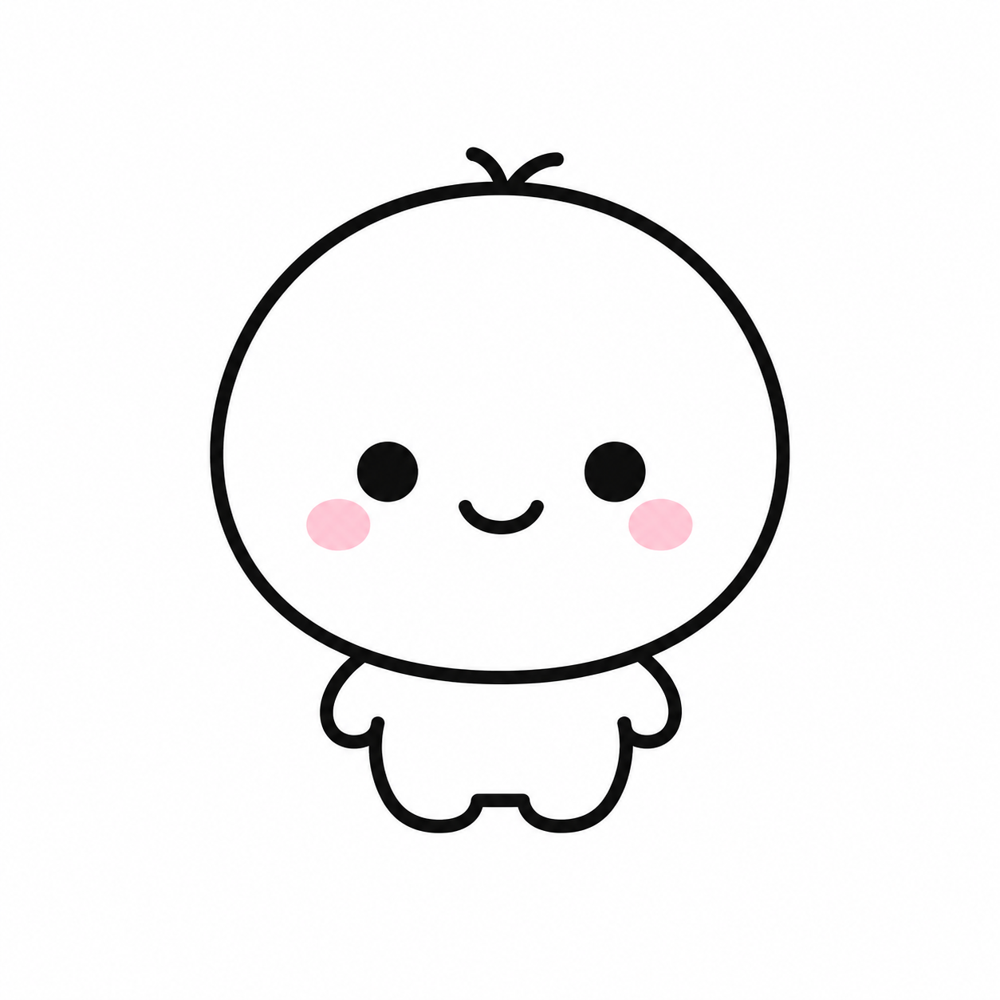
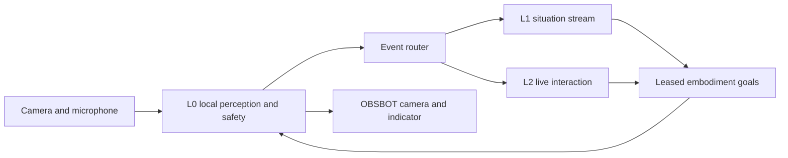

<p align="center">
  
</p>

<h1 align="center">SOMA</h1>

<p align="center">
  A local-first, embodied macOS companion for perception, conversation, and safe camera attention.
</p>

<p align="center">
  <a href="COGNITIVE_ARCHITECTURE.md">Architecture</a> ·
  <a href="TECHNICAL_REFERENCE.md">Technical reference</a> ·
  <a href="PLAN.md">Roadmap</a>
</p>

SOMA connects local camera and microphone perception to deliberate interaction
without giving language models direct physical-control authority. It is built
for macOS and an OBSBOT Tiny 2 Lite, with an optional account-backed live voice
path and a native menu-bar control surface.

> **Project status:** active local research runtime. Hardware actuation is
> explicitly opt-in; the default probe and most development paths are
> non-actuating.

## Highlights

- **Local L0 perception and safety.** Vision, VAD, target continuity, spatial
  coverage, and the final camera-control veto stay in a deterministic local
  layer.
- **Bounded higher-level control.** L1 situation understanding and L2 Codex
  interaction can request leased goals through a local embodiment interface;
  neither sends camera SDK commands directly.
- **Private identity boundary.** Administrator recognition requires explicit
  local enrollment and repeated profile matches. Face templates stay encrypted
  on this Mac and do not enter the activity trace or L2 context.
- **Human-readable hardware feedback.** The menu bar configures the verified
  Tiny 2 Lite LED palette, response policy, brightness, and state meanings.

## Architecture at a glance

| Layer | Purpose | Physical authority |
| --- | --- | --- |
| **L0 — subconscious** | Local perception, target continuity, VAD, safety checks, and motor execution | Sole SDK and physical-veto authority |
| **L1 — situation stream** | Memory-aware interpretation, social context, and goal-level attention | Bounded leased goals only |
| **L2 — interaction** | Live conversation, reasoning, and user-requested tasks | Bounded leased goals only |

The complete layer and authority model is in
[COGNITIVE_ARCHITECTURE.md](COGNITIVE_ARCHITECTURE.md).



## Menu bar control

Build and open the local status-menu application during development:

```sh
swift run soma-menu-bar
```

The settings window groups the controls by intent:

| Area | What it controls |
| --- | --- |
| **Realtime voice** | Enable spoken conversations and choose the account-backed voice, including `Maple`. |
| **LED response** | Choose Expressive, Contextual, Quiet, or Off; set brightness from 0–3. |
| **LED signals** | Assign a verified colour and supported behaviour to each interaction state. The device offers yellow, blue, and green; continuous blinking is available only through the verified blue firmware state. |
| **Attention movement** | Restrict verified-human tracking and no-target exploration capabilities already approved for the running service. |
| **Administrator identity** | Enroll the face currently in view, set a display name/preferred address, observe verification status, or remove the local enrollment. |
| **Current activity** | Read the local runtime’s Vision, Voice, Identity, Embodiment, and indicator state. |

Settings are written to the local owner-only SOMA settings file and are applied
when the service starts. The runtime does not claim arbitrary RGB or software
blink patterns that the hardware cannot reliably render.

## Quick start

### Requirements

- macOS 13 or later
- Swift 6 toolchain
- OBSBOT Tiny 2 Lite for live camera and indicator features
- Vendor SDK only for explicitly enabled native camera control
- A signed-in local Codex installation only for the account-backed live voice path

### Build and test

```sh
swift build
swift test
```

### Inspect connected capture devices safely

```sh
swift run soma-probe --list-formats
```

To run the 60-second, read-only capture probe, replace the IDs with the values
reported by the command above:

```sh
swift run soma-probe --duration 60 \
  --video-id '<OBSBOT video unique ID>' \
  --audio-id '<OBSBOT microphone unique ID>'
```

The probe emits scalar JSONL health telemetry. It does not record media or
move the camera.

### Install the local companion

The installation script packages the configured local helpers, code-signs the
app, and registers the menu-bar LaunchAgent for the current user:

```sh
swift build --build-path .build/soma-live
scripts/install-soma-subconscious-app.zsh
```

Review the script and the runtime’s explicit motion flags before using any
camera-control path.

## Repository guide

| Path | Contents |
| --- | --- |
| [`Sources/SOMACore`](Sources/SOMACore) | Shared contracts: cognition, memory, identity, settings, and embodiment leases |
| [`Sources/SOMASubconscious`](Sources/SOMASubconscious) | L0 perception, runtime orchestration, and local safety boundary |
| [`Sources/SOMANativeTracking`](Sources/SOMANativeTracking) | Native OBSBOT SDK bridge with explicit motion safeguards |
| [`Sources/SOMAMenuBar`](Sources/SOMAMenuBar) | Native status menu and settings window |
| [`Sources/SOMALiveVoice`](Sources/SOMALiveVoice) | Account-backed live voice helper |
| [`Tests/SOMACoreTests`](Tests/SOMACoreTests) | Core contract and regression tests |
| [`assets/branding`](assets/branding) | Canonical SOMA source illustration and branding assets |

## Documentation

| Document | Use it for |
| --- | --- |
| [Technical reference](TECHNICAL_REFERENCE.md) | Full runtime behaviour, command boundaries, hardware observations, traces, and calibration evidence |
| [Cognitive architecture](COGNITIVE_ARCHITECTURE.md) | Layer responsibilities, authority boundaries, cognitive contracts, and privacy model |
| [Roadmap](PLAN.md) | Planned work and execution sequence |
| [Models](MODELS.md) | Model roles and deployment boundaries |
| [VAD evaluation](docs/VAD_EVALUATION.md) | Voice-activity evaluation protocol and corpus constraints |

## Safety and privacy

- Camera movement, native human tracking, and autonomous scanning require
  explicit runtime authorization; omitted flags leave the camera non-actuating.
- L0 retains final ownership of the camera SDK, stabilization, watchdogs, joint
  limits, and immediate physical vetoes.
- Raw camera frames and microphone samples are not included in the normal trace.
- Administrator identity is local-only: the encrypted facial template is not
  included in L1/L2 context, activity records, or remote model input.

## Original icon source

The original character artwork is preserved at
[`assets/branding/soma-original.png`](assets/branding/soma-original.png). Use it
as the canonical source for menu-bar and application derivatives.
