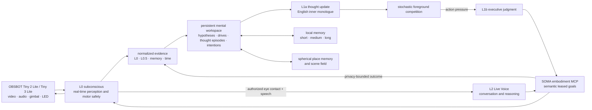

<p align="center">
  
</p>

<h1 align="center">SOMA</h1>

<p align="center">
  <strong>An embodied-AI research interface for attention, memory, and human-like interaction.</strong>
</p>

<p align="center">
  <a href="https://www.obsbot.com/obsbot-tiny-2-lite-4k-webcam">OBSBOT Tiny 2 Lite</a> ·
  <a href="https://www.obsbot.com/obsbot-tiny-3-lite">OBSBOT Tiny 3 Lite</a> ·
  macOS 13+ · Swift · Core ML · Model Context Protocol · Codex Live Voice
</p>

<p align="center">
  
  
  
</p>

<p align="center">
  <a href="#why-soma">Why SOMA</a> ·
  <a href="#the-cognitive-architecture">Architecture</a> ·
  <a href="#the-embodiment-interface">Embodiment MCP</a> ·
  <a href="#run-a-safe-probe-first">Getting started</a> ·
  <a href="COGNITIVE_ARCHITECTURE.md">Technical architecture</a>
</p>

> [!NOTE]
> SOMA is not a “camera assistant” and not an autonomous task agent. It is a
> research system for building an interface through which artificial
> intelligence can perceive, attend to, remember, and interact with people in
> a way that feels situated rather than merely reactive.

## Why SOMA

Most assistants begin after a user has typed or spoken a command. Human
interaction begins much earlier: someone enters a room, glances over, pauses,
speaks, changes posture, or returns after an earlier conversation. Those events
occur on different time scales and they call for different kinds of cognition.

SOMA investigates how to connect them without pretending that a single model
should do everything:

- **Perception must react in milliseconds.** A moving face, an interrupted
  voice, or a lost target cannot wait for a long reasoning cycle.
- **Interpretation needs continuity.** A familiar person, a room, a prior
  conversation, and an unfinished question only make sense across time.
- **Interaction needs embodiment.** Where the camera looks, how it pauses, a
  small acknowledgement motion, and an indicator light are part of the social
  signal—not decorative output.
- **Deliberation must remain accountable.** Higher-level models may decide what
  deserves attention, but a local physical boundary still owns the final motor
  command, joint envelope, watchdog, and stale-evidence veto.

The resulting system is an **embodied interaction interface**: a platform for
studying how an AI can share attention with a person, develop contextual memory,
and choose when to speak, stay quiet, look again, or express readiness.

## The body: OBSBOT Tiny

SOMA recognizes connected OBSBOT hardware from the vendor SDK product type,
not from a UVC display name. It was developed around the
[OBSBOT Tiny 2 Lite](https://www.obsbot.com/obsbot-tiny-2-lite-4k-webcam), and
also has a guarded profile for the
[OBSBOT Tiny 3 Lite](https://www.obsbot.com/obsbot-tiny-3-lite). Both are
treated as sensorimotor bodies rather than passive webcams:

| Hardware affordance | Role in SOMA |
| --- | --- |
| UVC video | Low-latency visual evidence, face/person/object observations, scene change, and spherical mapping |
| USB audio | On-device voice-activity evidence and live conversation audio |
| 2-axis gimbal | Fixation, re-acquisition, active exploration, and compact nonverbal expressions |
| Firmware LED feedback | A nearby person can see the state the connected model can physically express |

The camera's vendor SDK is used only by a separately enabled local bridge. It
does not become a direct model tool or a free-form velocity interface.
The [device adapter contract](docs/OBSBOT_DEVICE_ADAPTER.md) carries the
connected product's verified control surface from that bridge to the launcher
and runtime. An unfamiliar OBSBOT remains a perception-and-conversation body
until it has both an adapter and a matching calibration; replacing hardware
does not silently borrow another camera's motor or LED assumptions.

| SDK profile | Available without new calibration | Intentionally withheld |
| --- | --- | --- |
| `tiny_2_lite` | Video, USB audio, calibrated gimbal control, firmware indicator palette | — |
| `tiny_3_lite` | Video, USB audio, selectable microphone modes, profile-calibrated L0 gimbal control, native human-track policy, firmware status LED, and Live Voice | Tiny 2 motor calibration and a host-readable sound bearing |

This is a physical boundary, not a feature downgrade: calibration signs,
motion envelopes, sound-localization semantics, and LED state IDs are
device-specific observations. A Tiny 3 Lite therefore uses its own measured
attitude frame and native tracker configuration; it never inherits Tiny 2 Lite
motion or indicator assumptions. Each profile requires independent calibration
and physical LED validation before a capability is exposed as available.

## The cognitive architecture

SOMA organizes cognition by **latency, context horizon, and authority**. The
layers are connected, but they are not interchangeable.

| Layer | Time scale | What it does | What it may control |
| --- | --- | --- | --- |
| **L0 · subconscious** | Video/audio cadence | Captures sensor evidence, follows a verified face, keeps target continuity, estimates voice activity, maintains spatial coverage, and executes the final motor policy | The only path to SDK motion, stabilization, limits, watchdogs, and immediate stops |
| **L0.5 · local semantic helper** | Sparse asynchronous inference and temporal evidence integration | Produces evidence deltas for L1 without blocking L0; it does not call the language model directly | No independent motor, speech, identity, memory, or wake authority |
| **L1a · persistent thought stream** | Event-driven plus an adaptive stochastic clock | Maintains hypotheses, curiosity, goal-linked thought episodes, self-correction, and a probabilistically selected foreground thought in one persistent mental workspace | May form an abstract intention and request bounded visual evidence; cannot speak or move hardware |
| **L1b · executive judgment** | Only when an L1a intention creates action pressure | Chooses one currently available social or attention action against a frozen workspace revision | Semantic attention, labels, tracking goals, exploration policy, view requests, and expressions through existing leased MCP/L0 goals |
| **L2 · conversation and executive reasoning** | Human turn time | Conducts account-backed live conversation, high-order reasoning, and goal-directed tool use when grounded information is needed | The same semantic embodiment interface as L1; never raw SDK velocity |

L2 may inspect perception or memory and may request reversible attention actions
without waiting for a literal tool command when that action advances the current
conversational goal. This initiative is enforced by the MCP server, not only by
the model prompt: every call carries a stable goal episode and an authorization
basis. Participant-coupled operations also require a server-issued grant for the
current spoken turn. Unknown tools fail closed, durable memory requires a grounded statement,
identity enrollment requires consent, and device configuration requires an
explicit request. Tool results return to the mental workspace as bounded
evidence, with semantic request fingerprints preventing paraphrased duplicate
calls without retaining raw result payloads.

Issuing an action is not treated as satisfying its goal. Dispatch is recorded
first; the linked thought and intention remain active until later evidence meets
their observable completion condition, makes the goal impossible, or causes L1a
to revise it. This keeps tool use inside the same perception-thought-action-
verification loop as embodied behavior.

L0.5 is intentionally a supporting process inside the L1 path, not a fourth
mind. Its job is to make slow contextual reasoning more perceptive without
weakening the real-time loop. Every cue is reduced into the same workspace as
face, gaze, voice, memory, conversation, and elapsed-time evidence. Only a
meaningful workspace transition may wake L1a; repeated equivalent cues merely
support an existing hypothesis. Neither path controls movement or conversation
directly.



This loop lets a high-level model influence *why* SOMA looks somewhere, which
object matters, how long attention should persist, or whether a gesture would
be appropriate—while L0 remains responsible for *how* the hardware gets there
safely and continuously.

## From sensing to social interaction

### 1. Notice

L0 treats visual and auditory evidence as separate but converging signals.
Core ML face/person/object observations, landmark confirmation, target
continuity, on-device VAD, and gimbal pose are combined into a current belief
about what is present and what deserves immediate attention.

### 2. Maintain shared attention

The gimbal is not only a tracker. It can hold a face, recover a briefly lost
person, inspect uncertain space, and explore unobserved but reachable regions.
A spherical scene field and rolling panoramic map allow past observations to
remain spatially meaningful as the camera moves.

### 3. Interpret the situation

L1 receives bounded, policy-filtered context rather than a permanent raw video
stream. It can combine a current scene, a person's relationship history,
explicit preferences, open information needs, place memory, and previous
thought state. It may decide to remain silent, make a nonverbal invitation, or
open a conversation with a concrete purpose.

### 4. Converse without losing the body

An authorized direct human contact can open an L2 Live Voice session, while L1
can also initiate a conversation when it has a concrete purpose. L2 receives
the private conversational objective and relevant memory context, then responds
to the person's actual words. During a conversation it can proactively use the
narrowest permitted SOMA MCP tool when doing so materially reduces uncertainty
or advances the active goal. Perception and memory reads are autonomous;
durable identity or person-memory changes still require a grounded statement or
consent, and every motor request remains leased through L0.

Camera imagery is not streamed into conversation as a running caption feed.
When visual evidence is genuinely useful, L2 can decide to call
`capture_view` through MCP and inspect that bounded, current resource itself.
This keeps a conversation from turning into unsolicited image description.
Each goal-directed call carries a stable cognitive goal identifier. Its raw
result stays in the current interaction, while only a bounded outcome summary
and result fingerprint return to the mental workspace. That closes the
perception–thought–action loop without duplicating successful equivalent calls
or persisting raw tool payloads.

## Memory as continuity, not a transcript dump

SOMA keeps several different forms of memory because an interaction has more
than one useful duration:

| Horizon | Examples | Role |
| --- | --- | --- |
| **Short-term** | Active tracks, current conversation turns, transient hypotheses | Supports the present interaction and bounded recovery |
| **Medium-term** | Recent episodes, open questions, current tasks, daily public-world brief | Gives L1 an evolving situation rather than a fresh start every cycle |
| **Long-term** | Explicitly confirmed preferences, rapport, familiar-place references, consolidated facts | Supports continuity across encounters without treating every observation as permanent truth |

Raw conversation turns remain in the encrypted local short-term journal before
L1 consolidates an allowed, typed memory. Identity and person-context changes
require explicit confirmation. A model may propose a memory update; it does
not get to invent one from tone or camera appearance.

## The embodiment interface

L1 and L2 use one local [Model Context Protocol](https://modelcontextprotocol.io/)
surface, `soma-embodiment`. The interface lets cognition customize nearly the
whole attention policy while keeping the physical executor local.

| Read and understand | Guide embodied behavior |
| --- | --- |
| Current attention and uncertainty | Register or revise a semantic target label |
| Stable scene entities, bearings, freshness, and action eligibility | Set probabilistic attention priors and tracking commitment |
| Spherical map, coverage, place familiarity, and available bearings | Track a grounded target or orient to a bearing |
| A fresh `capture_view` image or selected panorama data | Shape exploration regions, direction distributions, dwell, and tempo |
| Hardware capability report | Set a verified camera observation control or native human-track response policy |

Every mutating request includes an owner, evidence references, a priority, and
a bounded lease. L0 rejects stale or ambiguous targets, expires finished goals,
and resolves competing requests before anything reaches the vendor SDK.

## Presence is a communication channel

SOMA treats motion and light as part of interaction design:

- **Fixation** says “I am attending here.”
- **A short acknowledgement or thinking glance** can communicate intent without
  taking over a conversation.
- **Exploration** is driven by coverage, novelty, place uncertainty, and
  remembered bearings—not a fixed left-right sweep.
- **LED state** is semantic: it can make human presence, interaction readiness,
  active conversation, and cognitive work legible from across the room.

The Tiny 2 Lite exposes a firmware-defined RGB palette and pattern states—not
arbitrary 24-bit color. Tiny 3 Lite uses its firmware status machine: persistent
`SYSTEM_READY(3)` plus `NORMAL_WORKMODE(54)` is green exploration, work state
`57` is blue human presence and contact cadence, and state `16` provides the
yellow active-conversation presentation. The bridge restores `3 + 54` whenever
a temporary state ends. Its experimental direct-RGB packet route was invalid
and has been removed.

## Privacy and physical boundaries

SOMA is designed around the fact that a socially responsive camera is sensitive
by default.

- Scalar runtime traces do not contain raw camera frames, PCM, biometric
  templates, or direct SDK payloads.
- Face templates and raw conversation turns are encrypted local records; they
  are not placed in L1 prompts or normal diagnostic traces.
- Visual capture for a reasoning turn is bounded and short-lived rather than a
  rolling remote camera feed.
- Identity enrollment, persistent personal facts, and preference changes are
  explicit actions with confirmation.
- L1 and L2 can express high-level embodied intent, but only L0 owns final
  motion safety and the physical stop path.

See [COGNITIVE_ARCHITECTURE.md](COGNITIVE_ARCHITECTURE.md) for the detailed
authority, memory, and privacy contracts.

## Requirements

SOMA's Swift package has no remote SwiftPM dependencies. A full runtime uses:

- Apple Silicon Mac running macOS 13 or newer for the Swift package; macOS 26
  or newer for the full runtime installed by the current Brewfile
- Xcode command-line tools with a Swift 6 toolchain
- Homebrew OpenCV 5 for the Swift/C++ vision bridge
- CMake and the OBSBOT `libdev_v2.1.0_8` SDK for the native gimbal/LED bridge
- Ollama with the configured L1 model
- A compatible signed-in Codex installation when L2 Live Voice is enabled

For a clean Mac, use the dependency-aware bootstrap and then verify both the
build and runtime boundaries:

```sh
scripts/bootstrap-soma.zsh \
  --sdk-archive /absolute/path/to/libdev_v2.1.0_8.zip
scripts/soma-doctor.zsh --build
swift build
swift test
scripts/soma-doctor.zsh --runtime
```

The proprietary OBSBOT SDK is intentionally not stored in Git. Bootstrap
verifies its exact archive and stages it locally; `soma-doctor` verifies tool
versions, bundled-model hashes, the SDK signature and hashes, Ollama/model
availability, conditional Codex support, and optional MLX/ArcFace assets. See
[`DEPENDENCIES.md`](DEPENDENCIES.md) for the full clean-Mac procedure and
supported overrides.

## Run a safe probe first

SOMA is a research prototype with real hardware. Start with a non-actuating
probe before enabling any camera motion.

```sh
swift build
swift test

# Inspect connected capture devices and formats; this does not move the camera.
swift run soma-probe --list-formats

# Replace these values with the OBSBOT IDs reported above.
swift run soma-probe --duration 60 \
  --video-id '<OBSBOT video unique ID>' \
  --audio-id '<OBSBOT microphone unique ID>'
```

The probe writes health-only scalar JSONL. It does not record media or issue a
gimbal command.

For the native macOS control surface:

```sh
swift run soma-menu-bar
```

The menu bar application is where a local operator configures voice, indicator
semantics, attention policy, and explicit identity enrollment. A new Live Voice
session requires current eye contact, voice activity, and affirmative
audiovisual evidence that the tracked person is speaking. Once open, conversation remains gaze-independent
by default; an optional setting can require current eye contact for every spoken
turn. Quiet admitted speech is levelled with a bounded VAD-driven gain stage and
the initiating utterance is replayed after transport startup so session latency
does not discard the first words. Review the scripts and hardware flags before
enabling physical camera control.

<details>
<summary><strong>Local companion installation</strong></summary>

<br>

```sh
scripts/bootstrap-soma.zsh \
  --sdk-archive /absolute/path/to/libdev_v2.1.0_8.zip
# Review the owner-only configuration created by bootstrap before installation.
scripts/soma-doctor.zsh --runtime
# `auto` selects a single connected OBSBOT; use explicit IDs for multiple cameras.
scripts/install-soma-subconscious-app.zsh
scripts/soma.zsh start
scripts/soma.zsh status
```

The installer rebuilds the Swift and native helpers, signs a local app bundle,
writes `com.soma.menu-bar` and `com.soma.reactive-l0` LaunchAgents, and starts or
restarts them. macOS may then request Camera, Microphone, Speech Recognition,
and Accessibility permissions. The installed runtime is intended for a local
macOS user with the connected camera and—when Live Voice is enabled—a signed-in
Codex installation. Motion stays disabled until `.env` explicitly enables it
and the connected device has a valid calibration. Use `scripts/soma.zsh stop`,
`start`, `restart`, or `status` for subsequent service control.
</details>

## Repository map

| Path | Responsibility |
| --- | --- |
| [`Sources/SOMACore`](Sources/SOMACore) | Cognition contracts, memory, identity, semantic embodiment leases, attention, and spatial models |
| [`Sources/SOMASubconscious`](Sources/SOMASubconscious) | L0 capture/perception runtime, panorama worker, L1 situation stream, and local safety integration |
| [`Sources/SOMANativeTracking`](Sources/SOMANativeTracking) | Explicitly gated OBSBOT SDK bridge |
| [`Sources/SOMAEmbodimentMCP`](Sources/SOMAEmbodimentMCP) | MCP server for embodiment and person-context operations |
| [`Sources/SOMALiveVoice`](Sources/SOMALiveVoice) | Account-backed Codex app-server Live Voice helper |
| [`Sources/SOMAMenuBar`](Sources/SOMAMenuBar) | Native local settings, status, and diagnostics interface |
| [`Tests/SOMACoreTests`](Tests/SOMACoreTests) | Contract and regression tests for cognition, memory, embodiment, and spatial behavior |

## Research status

SOMA is actively developed hardware-facing research software, not a finished
consumer assistant. The project already contains the real-time L0 loop,
semantic embodiment contracts, identity and memory infrastructure, rolling
spatial mapping, LED presence semantics, and an account-backed Live Voice
route. The important remaining work is empirical: evaluate perception and
interaction in real rooms, measure long-horizon memory quality, characterize
physical LED behavior, and test whether the resulting behavior is actually
experienced as attentive and appropriate by people.

Detailed implementation status and open acceptance work live in
[PLAN.md](PLAN.md), [MODELS.md](MODELS.md), and
[COGNITIVE_ARCHITECTURE.md](COGNITIVE_ARCHITECTURE.md).

## Project notes

- SOMA is an independent research project and is not affiliated with OBSBOT.
- OBSBOT and Tiny 2 Lite are trademarks of their respective owners.
- SOMA source code is licensed under [AGPL-3.0](LICENSE).
- Third-party model terms are documented in [MODELS.md](MODELS.md) and
  [THIRD_PARTY_NOTICES.md](THIRD_PARTY_NOTICES.md). The bundled YOLO11n package
  is AGPL-3.0; its terms apply to that asset.

## Artwork

[`assets/branding/soma-original.png`](assets/branding/soma-original.png) is
the canonical source illustration. [`soma-mark.png`](assets/branding/soma-mark.png)
is the compact display crop used here.
